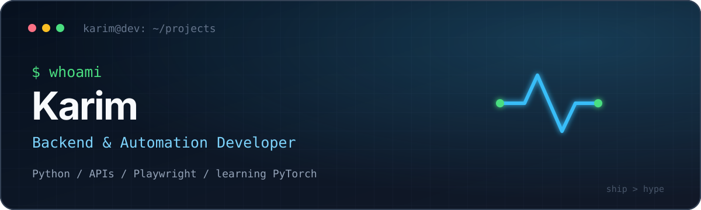

<div align="center">
  
</div>

<p align="center">
  I build practical Python tools that turn repetitive workflows into dependable systems.
</p>

<p align="center">
  <a href="https://karimsb15.github.io/cv/">Portfolio</a>
  ·
  <a href="https://github.com/karimsb15?tab=repositories">Projects</a>
</p>

## What I work with

```text
Languages       Python · JavaScript · TypeScript · HTML/CSS
Backend         Django · APIs · data processing
Automation      Playwright · Google Sheets · scheduled workflows
Learning now    PyTorch · Transformers · language-model fundamentals
```

## Selected builds

### [Developer CV](https://github.com/karimsb15/cv)

A compact, dark-mode developer landing page published with GitHub Pages.

`HTML` `CSS` `GitHub Pages`

### Own LLM — in progress

A learning-first implementation of a small GPT-style language model, covering tokenization, datasets, causal attention, training, generation, and tests.

`Python` `PyTorch` `pytest`

### Workflow Report Bot — preparing for release

A scheduled reporting tool that reads Google Sheets audit activity, counts unique edited rows, and writes daily reports with persistent state.

`Python` `Google Sheets API` `Automation`

### Task Manager CLI — preparing for release

A lightweight command-line task manager with JSON persistence and create, edit, complete, list, and delete workflows.

`Python` `JSON` `CLI`

## Current direction

- Building reliable backend and browser-automation tools
- Turning small scripts into documented, tested projects
- Learning how modern language models work from the inside out

---

<p align="center">
  <sub>Build small. Understand deeply. Ship useful things.</sub>
</p>
